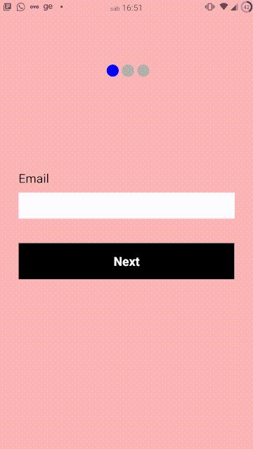
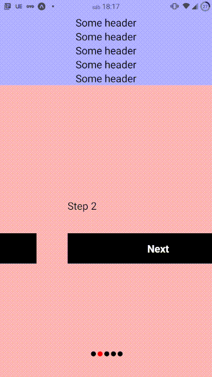

# react-native-step-view-navigation




## Table of Contents

- [Install](#install)
- [Usage](#usage)
- [License](#license)

## Install

```bash
npm install react-native-step-view-navigation
```
or
```bash
yarn add react-native-step-view-navigation
```


## Usage

You will add StepViews within StepNavigation and create your screens within StepView. <Br>
The StepNavigation Component has a mandatory prop called step. this prop indicates the screen that StepNavigation should be on. to change the screen, just change the value of the prop step to the number of the screen you want to navigate.


### Basic Example

```js
import React, { useState } from 'react';
import { StyleSheet, Text, TextInput, View, TouchableOpacity } from 'react-native';
import { StepNavigation, StepView } from 'react-native-step-view-navigation'


export default function App() {
  const [step, setStep] = useState(1)
  return (

      <StepNavigation step={step}>
        <StepView>
          <View style={[{ backgroundColor: 'pink', flex: 1, justifyContent: 'center', padding: 30 }]}>
            <Text style={styles.label}>Email</Text>
            <TextInput style={styles.input} />
            <TouchableOpacity style={styles.btn} onPress={() => setStep(2)} >
              <Text style={{ color: '#fff', fontWeight: 'bold', fontSize: 20 }}>Next</Text>
            </TouchableOpacity>
          </View>
        </StepView>
        <StepView>
          <View style={[{ backgroundColor: 'gray', flex: 1, justifyContent: 'center', padding: 30 }]}>
            <Text style={styles.label}>name</Text>
            <TextInput style={styles.input} />
            <TouchableOpacity style={styles.btn} onPress={() => setStep(3)} >
              <Text style={{ color: '#fff', fontWeight: 'bold', fontSize: 20 }}>Next</Text>
            </TouchableOpacity>
          </View>
        </StepView>
        <StepView>
          <View style={[{ backgroundColor: 'yellow', flex: 1, justifyContent: 'center', padding: 30 }]}>
            <Text style={styles.label}>password</Text>
            <TextInput style={styles.input} />
            <TouchableOpacity style={styles.btn} onPress={() => setStep(1)} >
              <Text style={{ color: '#fff', fontWeight: 'bold', fontSize: 20 }}>Next</Text>
            </TouchableOpacity>
          </View>
        </StepView>
      </StepNavigation>
  );
}

const styles = StyleSheet.create({

  btn: {
    width: '100%',
    backgroundColor: 'black',
    padding: 16,
    alignItems: 'center',
    justifyContent: 'center',
    marginTop: 40,
  },

  label: {
    fontSize: 20,
  },
  input: {
    marginTop: 10,
    backgroundColor: '#FFF',
    height: 42
  },
});
```

### Complex Example

```js
import React, { useState } from 'react';
import { StyleSheet, Text, View, TouchableOpacity } from 'react-native';
import { StepNavigation, StepView } from 'react-native-step-view-navigation'

function Step(props) {
  return (
    <StepView>
      <View style={[{ backgroundColor: 'pink', flex: 1, justifyContent: 'center', padding: 30 }]}>
        <Text style={styles.label}>Step {props.me}</Text>
        <TouchableOpacity style={styles.btn} onPress={() => props.next(props.me)} >
          <Text style={{ color: '#fff', fontWeight: 'bold', fontSize: 20 }}>Next</Text>
        </TouchableOpacity>
      </View>
    </StepView>
  )
}


export default function App() {
  const [step, setStep] = useState(1)

  const numberOfSteps = 5
  let steps = []
  for (let index = 0; index < numberOfSteps; index++) {
    steps.push(<Step key={index} me={index + 1} next={(me) => me == numberOfSteps ? setStep(1) : setStep(me + 1)} />)
  }

  return (
    <View style={{ flex: 1 }}>
      <View style={{alignItems: 'center', paddingTop: 30, backgroundColor: '#aaaaff'}}>
        <Text style={styles.label}>Some header</Text>
        <Text style={styles.label}>Some header</Text>
        <Text style={styles.label}>Some header</Text>
        <Text style={styles.label}>Some header</Text>
        <Text style={styles.label}>Some header</Text>
      </View>
      <StepNavigation
        dotsColor={'red'}
        dotsDisabledColor={'black'}
        dotsDistance={3}
        dotsMargin={30}
        dotsPosition={'Bottom'}
        dotsSize={10}
        transitionDuration={1000}
        step={step}
      >
        {steps}
      </StepNavigation>
    </View>
  );
}

const styles = StyleSheet.create({

  btn: {
    width: '100%',
    backgroundColor: 'black',
    padding: 16,
    alignItems: 'center',
    justifyContent: 'center',
    marginTop: 40,
  },

  label: {
    fontSize: 20,
  },
  input: {
    marginTop: 10,
    backgroundColor: '#FFF',
    height: 42
  },
});
```




### StepNavigation Props

| Props  	| Type  	| Default<Br> value  	|  Description 	|
|---	|---	|---	|---	|
|   step	| number  	|   	| number of the screen being displayed  	|
| dots  	| boolean  	| true  	| step indicator activated   	|
| dotsPosition  	| "Top" or "Bottom"  	| Top  	| step indicator position  	|
| dotsMargin  	| number  	| 60  	| margin top or bottom of the step indicator  	|
| dotsDistance  	| number  	| 5  	| distance between dots  	|
| dotsSize  	| number  	| 20  	| dots size  	|
| dotsColor  	| string  	| "blue"  	| dot active color   	|
| dotsDisabledColor  	| string  	| "#aaa"  	| dots disabeld color   	|
| transitionDuration  	| number  	| 800  	| transition duration  	|

## License

ISC
